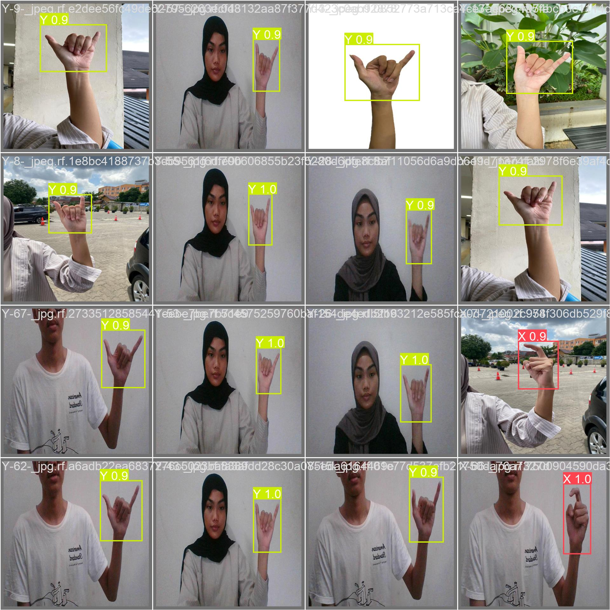
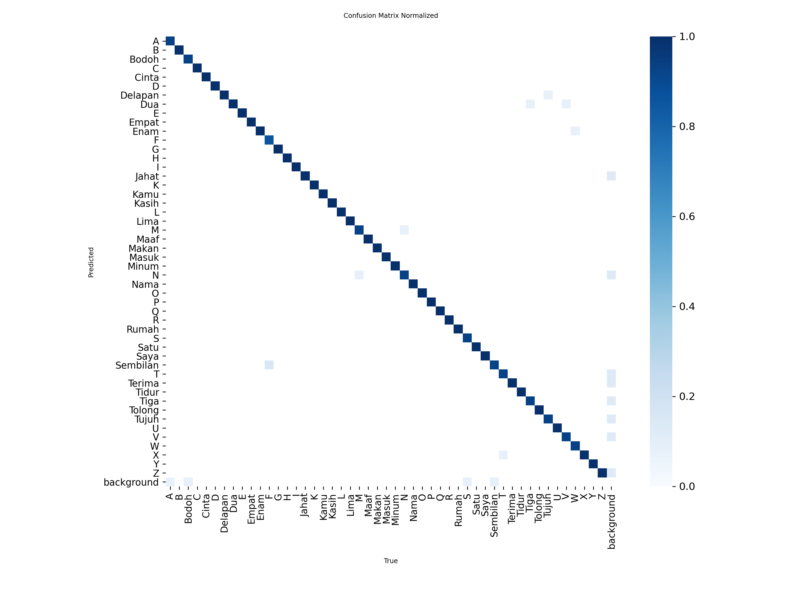

# SiBiSee: Real-time SIBI Detection with YOLOv8-CBAM 👋

[](https://www.python.org/)
[](https://streamlit.io/)
[](https://github.com/ultralytics/ultralytics)
[](https://pytorch.org/)
[](LICENSE)

**SiBiSee** is a web-based application designed to bridge the communication gap for the Deaf community by translating **Indonesian Sign Language (SIBI)** into text in real-time. This project integrates the **Convolutional Block Attention Module (CBAM)** into the **YOLOv8** architecture to enhance detection accuracy, especially for complex hand gestures and dynamic backgrounds.

🔗 **Live Demo:** [Click Here to Open App](https://sibisee.streamlit.app)

---

## 📸 Screenshots

| Real-time Detection | Confusion Matrix |
| :---: | :---: |
|  |  |

---

## ✨ Key Features

* **🎥 Real-time Video Detection:** Uses WebRTC to stream video directly from the browser to the model with low latency.
* **📷 Dual Input Mode:** Supports both live camera streaming and static image uploads (file/snapshot).
* **🧠 Attention Mechanism:** Integrated CBAM (Channel & Spatial Attention) allows the model to focus on fine-grained finger details.
* **⚡ Optimized for Web:** Deployed on Streamlit Cloud with Twilio TURN servers for stable connectivity across different networks.

---

## 📂 Dataset Details

The model was trained using the **SIBI - v2 SIBI** dataset, sourced publicly from **Roboflow Universe**. This dataset provides a comprehensive collection of hand gestures representing the Indonesian Sign Language alphabet.

* **Dataset Name:** SIBI - v2 SIBI
* **Source Link:** [Click here to view on Roboflow](https://universe.roboflow.com/sibi-detection-nftzq/sibi-bieme/dataset/2)
* **Total Images:** 4,802 images
* **Classes:** 26 Classes (Alphabets A-Z)
* **Format:** YOLOv8 Oriented Bounding Boxes (OBB) / Standard Object Detection
* **Preprocessing:** Auto-orientation and pixel normalization (640x640 px)

### Data Split Strategy
To ensure objective evaluation, the dataset was split into three subsets:

| Subset | Image Count | Percentage | Purpose |
| :--- | :---: | :---: | :--- |
| **Train** | 3,361 | 70% | Model learning and weight updates |
| **Validation** | 961 | 20% | Hyperparameter tuning and metric monitoring |
| **Test** | 480 | 10% | Final performance evaluation (unseen data) |

---

## 📊 Model Performance

The model was trained from scratch for **100 epochs** on a dataset of 4,802 SIBI images. The integration of CBAM showed significant improvements in **Precision**, reducing false positives in similar gestures (e.g., 'M' vs 'N').

| Metric | YOLOv8s (Baseline) | **SiBiSee (YOLOv8s-CBAM)** |
| :--- | :---: | :---: |
| **mAP@0.5** | 99.2% | **99.0%** |
| **mAP@0.5:0.95** | 88.6% | **88.3%** |
| **Precision** | 97.7% | **97.8%** 🔼 |
| **Recall** | 98.1% | **97.5%** |

> **Note:** The proposed model achieves competitive accuracy while being trained purely from scratch, demonstrating strong feature learning capabilities without relying on pre-trained COCO weights.

---

## 🛠️ Tech Stack

* **Core:** Python 3.11
* **Computer Vision:** YOLOv8 (Ultralytics), OpenCV, Pillow
* **Deep Learning Framework:** PyTorch
* **Web Framework:** Streamlit, Streamlit-WebRTC
* **Infrastructure:** Twilio (TURN Server), Streamlit Cloud

---

## 🚀 Local Installation

If you want to run this project on your local machine, follow these steps:

### 1. Clone the Repository
```bash
git clone https://github.com/xebec51/SiBiSee.git
cd SiBiSee
```

### 2. Create a Virtual Environment

```bash
# Windows
python -m venv venv
.\venv\Scripts\activate

# Mac/Linux
python3 -m venv venv
source venv/bin/activate
```

### 3. Install Dependencies

```bash
pip install -r requirements.txt
```

### 4. Run the Application

```bash
streamlit run src/app.py
```

> **Tip:** For local development, the app will use Google's public STUN server by default. For production-grade reliability, configure your Twilio credentials in `.streamlit/secrets.toml`.

---

## 📂 Project Structure

```text
SiBiSee/
├── assets/             # Images for README (screenshots, charts)
├── docs/               # Final Report (PDF)
├── models/             # Trained YOLOv8 weights (.pt)
├── notebooks/          # Jupyter Notebooks for training experiments
├── src/                # Source code for the Web App
│   └── app.py          # Main Streamlit application
├── .gitignore          # Git ignore rules
├── packages.txt        # Linux dependencies for Streamlit Cloud
├── README.md           # Project documentation
└── requirements.txt    # Python dependencies
```

---

## 👨‍💻 About the Author

**Muh. Rinaldi Ruslan** *Information Systems Student at Hasanuddin University*

A passionate software developer combining clean code with data intelligence to create impactful digital solutions.

---

## 📜 License

This project is licensed under the **MIT License**. See the [LICENSE](LICENSE) file for details.

<p align="center">
<small>Built with ❤️ using Streamlit and YOLOv8</small>
</p>
